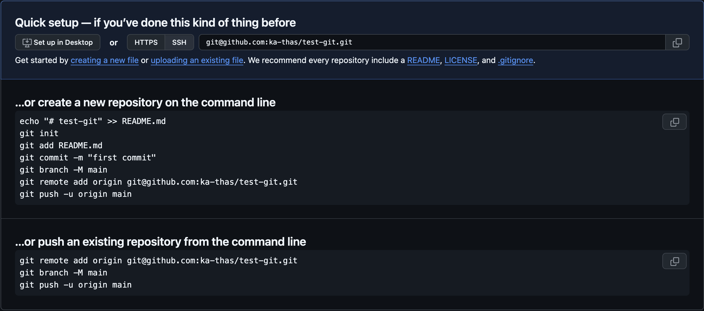

# Oppgaver

## Innhold

- [Oppgaver](#oppgaver)
  - [Innhold](#innhold)
  - [Terminologi](#terminologi)
  - [Level 1 - baby steps 🍼](#level-1---baby-steps-)
  - [Level 2 - Samarbeid med git 🤝](#level-2---samarbeid-med-git-)
  - [Level 3 - Pimp opp github profilen din 🖼️](#level-3---pimp-opp-github-profilen-din-️)
  - [Level 4 - Branching med lokal merge 🌳](#level-4---branching-med-lokal-merge-)
  - [Level 4 - Branching med Pull Request 🌳](#level-4---branching-med-pull-request-)
  - [Level 5 - .gitignore](#level-5---gitignore)
  - [Level 6 - Rammeverk for aliases](#level-6---rammeverk-for-aliases)

## Terminologi

Sortert fra enklest til vanskligst

| Begrep | Beskrivelse |
|--------|-------------|
| Repo | En mappe som inneholder alle filer og historikk for et Git-prosjekt |
| Commit | En endring i et repo |
| Push og pull | Oppdaterer det lokale repoet med remoten |
| Push | Send |
| Pull | Motta |
| Staging area | Område hvor filer legges før commit. Filer blir lagt til med `git add .`|
| Branch | En gren av prosjektet som lar deg jobbe med endringer uten å påvirke hovedgrenen (main). |
| Clone | Kopierer et repo fra en remote til en lokal maskin |
| Origin | Navnet på det eksterne repoet du har klonet fra |
| Remote | En ekstern kopi av et repo (f.eks. på GitHub) |
| Pull Request (PR) | En forespørsel om å merge en branch inn i en annen |
| Fork | En kopi av et repo som du eier |
| .gitignore | En fil som forteller git hvilke filer som skal ignoreres |
| README.md | En fil som vises på GitHub når du åpner et repo |
| Merge | Slår sammen to branches |
| Merge Conflict | Oppstår når to commits endrer samme linje, og Git ikke vet hvilken som skal beholdes |
| Fetch | Henter endringer fra en remote uten å merge dem |
| Stash | Lagrer endringer midlertidig |
|Squash | Slår sammen flere commits til én commit |

## Level 1 - baby steps 🍼

🌱 10 xp

Denne oppgaven blir demonstrert i plenum og er ment for de som aldri har brukt git før.

Alle oppgavene skal gjøres fra repoet du lager her eller i repoet der du leser oppgaveteksten.

Hele denne workshoppen handler om å gi dere mengdetrening i git og lære dere best practices, men det å instansiere repoer er ikke noe dere skal trenge å gjøre ofte.

To måter å opprette et repo på:

- Enten lokalt ved å kjøre `git init`
- Eller på GitHub ved å trykke på “New” og fylle ut feltene

Vi skal selvfølgelig gjøre det på IFI-måten - lokalt for å bygge forståelse av git og trygghet i terminalen

1. Lag et repo
2. Legg til README.md
3. Push til GitHub
4. Gjør en endring
5. Push igjen

## Level 2 - Samarbeid med git 🤝

🌱 20 xp

> Dette er nøyaktig slik man bidrar i open source prosjekter, bruker git i arbeidslivet, samarbeider med venner på hobbyprosjekt, eller jobber med en sammarbeidsoblig.
>
> Andre måter å bidra i open-source på er:
>
> - Skrive dokumentasjon
> - Rapportere feil / bugs
> - Etterspørre features
> - Lage grafisk design / musikk

**Oppgaven:**

1. Fork dette repoet
2. Clone forken (lokalt)
3. Gjør en endring (legg til en fil)
4. Push endringen
5. Opprett en “Pull Request” (PR)
6. […]
7. Pull etter jeg har godkjent alle PRene

## Level 3 - Pimp opp github profilen din 🖼️

1. Lag et repo som heter det samme som github brukernavnet ditt
2. Lag en README.md fil som beskriver deg selv
3. git add, commit, push
4. Gå til github.com/brukernavn

[Inspirasjon](https://github.com/abhisheknaiidu/awesome-github-profile-readme)

## Level 4 - Branching med lokal merge 🌳

1. Lag en branch med `git branch dev`
2. Gjør en endring
3. Commit
4. Bytt over til main branchen med `git checkout main`
5. Merge endringen inn i main branchen med `git merge dev`
6. Push

## Level 4 - Branching med Pull Request 🌳

1. Bruk samme branch - `git checkout dev`
2. Gjør en endring
3. Push endringen
4. Gå til GitHub og se at endringen er på branchen
5. Merge endringen inn i `main` branchen
6. Slett branchen
7. Pull

## Level 5 - .gitignore

1. Ignorer filer med .gitignore
2. Lag en ny fil kalt secret.txt.
3. Opprett en .gitignore-fil og legg til secret.txt i den.
4. Sjekk at git status ikke viser secret.txt.
5. Gjør en commit med .gitignore inkludert.

## Level 6 - Rammeverk for aliases

For dere som fortsetter å bruke git i terminalen fins dette repoet med forkortelser for git kommandoer:

<https://github.com/ohmyzsh/ohmyzsh/blob/master/plugins/git/README.md>
