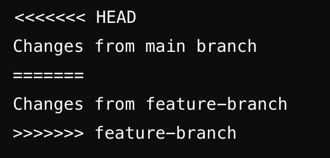

# Velkommen til Git Good 🌱

## Menti

## Hvorfor lære Git?

Relevant for

- IN2000 - Samarbeid
- IN2140 - Oblig 2 og HE
- IN1010 - Oblig 4 + lurt og være tidlig ute
- Egne prosjekter
- Arbeidslivet ←

## Hva er git?

Fun facts

- Linus Torvalds
- "Global information tracker": you're in a good mood, and it actually works for you
- "Goddamn idiotic truckload of sh*t": when it breaks
- Linus lagde git på 5 dager, og på den 6. dagen hvilte han
  - note: Mye som måtte gjøres manuelt på den tida

Så igjen - Hvorfor lære git?

- Har du noen gang vært i denne situasjonen?
  - `assignment3.docx`
  - `assignment3 finished.docx`
  - `assignment3 final.docx`
  - `assignment3 final v2.docx`
  - `assignment3 final v2 FINAL.docx`
  - `assignment3 final v2 FINAL frfr.docx`
  - `assignment3 final v2 FINAL i_swear.docx`

- Tegne graf

## Hva er GitHub da?

- Kun en nettside/server som tar vare på filene dine
- Litt som iCloud, OneDrive, og Google Drive
- Har profiler
- forks

## Hvordan jeg bruker Git

- Skal man bruke github.uio.no eller github.com?
  - mister tilgang på UiO-githuben når man går ut av UiO
  - github.com kan man bruke som porterfølje og for å hoste nettsider
- Struktur på repoene mine
- VSCode

## Hands-on practice

Learn by doing AKA. Fuck around and find out

Dette er tross alt en workshop, så jeg skal ikke stå her og yappe hele dagen

Hjelp naboen hvis de står fast

## Oppgave 1

[oppgaveteksten](./oppgaver.md/#level-1)

## Litt om `.git` mappen

Veeeldig lite. Så vidt dyppe tærne.

## Oppgave 2

[oppgaveteksten](./oppgaver.md/#level-2)

## Branching

## Merge Conflicts

## Veien videre

- Fork andres prosjekter
- Håndtere merge conflicts
- Gjør ferdig [oppgavene](oppgaver.md)